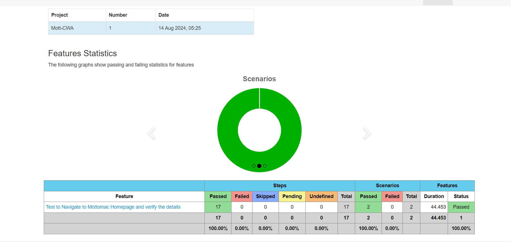

Cucumber BDD framework

This Project is designed to Test the Mottomac WebPage Functionalities with the help of Selenium , Core Java and Cucumber BDD framework

Please use below commands (If you are running through Terminal/command prompt)

mvn clean verify

Example Report

Reports can be found on target/report/cucumber-html-reports/overview-features.html
